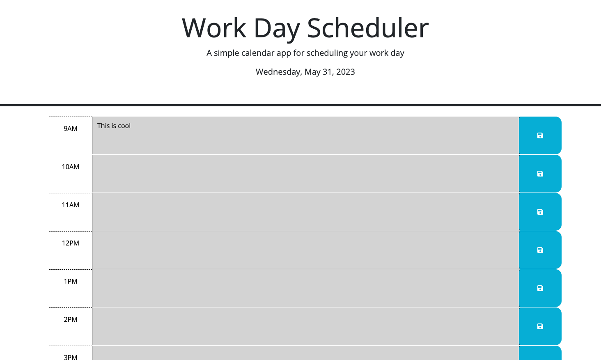

# WorkDayScheduler
Project Description: The goal of this project was to create a simple calendar application that allows a user to save events for each hour of the day by modifying starter code. Using the provided the CSS, HTML and starter Javascript code, I was able to create a calendar web app quiz that met the following criteria:

    * When a user opens the planner, the current day is displayed at the top of the calendar
    * When the user scrolls, they are presented with timeblocks for standard business hours (9AM-5PM)
    * When the user view the timeblocks for that day, each timeblock is color coded to indicate whether it is in the past, present, or future
    * When the user clicks into a timeblock, they can enter an event and save that timeblock
    * When the user saves an event, the text for that event is saved in the local storage, that persists after the page refreshes

Authors
*Keiquan Blackmon

Screenshot

Repo:
https://github.com/Yepitskeys/WorkDayScheduler